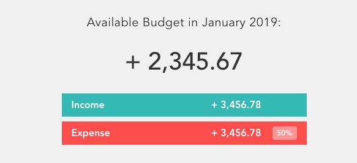
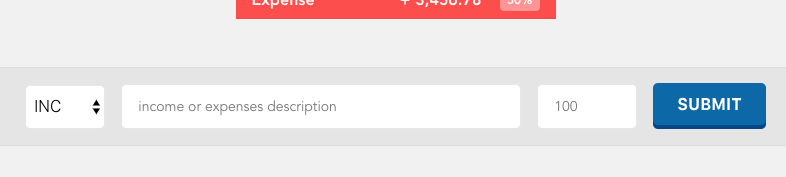

# シンプルな家計簿アプリBudgetyを作ってみよう！
[前の章はこちら](./page2.md)

前章ではディレクトリ構造とSFCをざっくりと学びました。  
この章からは実際にアプリを作り始めます。
まずはJavascriptを用いたロジックなどを考えずに、HTMLで最低限の見た目だけ作ってしまいましょう。

> ##### チョイ足しポイント
>これから各コンポーネントを作成していきますが、ゼロから作成するのではなく`vuetify`のようなUIフレームワークを用いて実装してみてください。

## 4. 上部のコンポーネントを作る
まずはタイトルっぽい物や収支バランスを表示する、上部のコンポーネントを作成していきます。
#### この部分
<p align="center"></p>


### 4-1. 土台となるコンポーネントを作成する
まずは新しくSFCを作っていきましょう。
`component` ディレクトリに `main-content.vue` ファイルを作成し、以下のようにコードを書いてください。

```vue
<!-- src/components/main-content.vue -->
<template>
    <div class="mainContent">
        main content.
    </div>
</template>

<script>
export default {}
</script>
```
これで新しいコンポーネントを作る事が出来ました。
既にお気付きになられていると思いますが、SFCでは `template` の中にHTMLを、 `script` の中にvueで扱うjavascriptのコード、ロジックやデータなどを、`style`の中にCSSを書いていく形になります。

> `<style>` は？と思われた方もいるかもしれませんが、特に書くコードがなければ省略する事が出来ます。これは `<template>`, `<script>` タグも同様です。ただし `<template>` と `<style>` を省略して `<script>` のみ用いるのはSFCを使う恩恵はあまりないので、その場合は通常通り`.js`や`.ts`ファイルを使う事をオススメします。cssも同様に外部スタイルシートを用いましょう。

> #### チョイ足しポイント
> SFCでは素のHTMLやJavascript、CSSの代わりにPugやTypescript,Sassなどを利用する事が出来ます。  
> 今後の開発を進める前にこれらのセットアップを行い、用いて開発をしてみてください。


### 4-2. コンポーネントの読み込み
新しいコンポーネントを作成はしましたが、まだ読み込まれていないので表示されていません。
App.vueからmain.vueを読み込み、表示します。

```vue
<!-- src/App.vue -->
<template>
    <div id="app">
        <!-- 
            <MainContent /> でもOK。
            Vue公式ではダッシュケースを推奨。 
        -->
        <main-content />
    </div>
</template>

<script>
import MainContent from './components/main-content.vue' // <- 拡張子を必ず付ける事。

export default {
    name: 'app',
    components: {
        MainContent
    }
}
</script>

<style>
/* そのまま */
</style>
```
#### 4-2-1. 各パートの解説

##### scriptタグ
`import Main from './components/main-content.vue'`  
  es2015のimport構文を用い、vueファイルを読み込みます。読み込む際には拡張子`.vue`が必須となります。  
_※ `.js`や `.ts` は省略出来ますが `.vue` は出来ません。_

`components: { Main }`  
  各コンポーネントを利用可能にする為に`components`オプションにコンポーネントを登録します。  
  `import`で読み込んだコンポーネントは全てここに追記していきます。  
  フォーマットはObjectです。 Key valueがtemplate内でのタグの名前になります。  

 ##### templateタグ
  `<main-content />`  
    読み込んだコンポーネントを描画する為にタグとして利用します。タグの名前はcomponentsに登録したkey valueです。  
    キャメルケース、アッパーキャメルケース(e.g. projectName / ProjectName)で登録されたコンポーネントは、template内でダッシュケース（ケバブケース、ハイフンつなぎ）(e.g `<project-name>`)を使う事が可能です。  
    Vue公式ではこのダッシュケースを推奨しています。

#### 4-2-2. 正しく読み込まれているか確認する
[`http://localhost:8080`](http://localhost:8080)をブラウザで開いて、正しくコンポーネントが読み込まれているか確認してみましょう。  
真っ白なページにぽつんと寂しく `main content` とテキストが表示されていれば成功です。

これでベースとなるコンポーネントが作れました。  
今後作成したコンポーネントはこの`main.vue`に追加していく事にします。


### 4-3. ヘッダー部分を作る
まずはヘッダーを作りましょう。
ヘッダーやフッター、ナビゲーションと言った要素は各ページ共通である事が多いため、  
真っ先にコンポーネント化が検討される部分です。

> ##### なぜコンポーネント化するのか
> コンポーネント化する最大の目的は、再利用性・保守性を高める事にあります。各ページに共通する部分や、何度も繰り返し現れる要素をコンポーネント化する事により開発速度の向上にも繋がります。また何か修正などが発生した場合にも該当するコンポーネントのみ修正を行えばいいので保守性にも優れます。特にフロントエンド開発ではプロジェクトが進んでいくと何度も修正する事になる場合が多々あり（時には昨日作った物を今日作り直すなども起こります。）、コンポーネント化によりその影響を最小限にする意味合いもあります。  

#### 4-3-1. コンポーネントを作成する
新しく `src/components` 下に `the-header.vue` を作成してください。

> ##### なぜTheを付ける？
> これは`<header>`というタグはHTMLに既に存在し、VueがHTMLの`<header>`なのかVueコンポーネントの`<Header>`なのか判断がつかなくなるからです。他にも`default`なども正しく表示されません。この辺りのルールは[Vueスタイルガイド](https://vuejs.org/v2/style-guide/index.html)を参照してください。

`the-header.vue`を作成し開いたら、以下の様にコードを記述してください。
```vue
<!-- src/components/the-header.vue -->
<template>
    <header>
        <h1 class="title">Budgety</h1>
    </header>
</template>

<!-- 今回は特にする事がないので<script>は省略。-->

<style scoped>
    header {
        background: #333;
        width:100%;
    }
    .title {
        color: #fff;
        font-weight: 500;
        letter-spacing: 0.04em;
    }
</style>
```

ここで新しい要素が出てきました。  
`<style>` に何やら `scoped` と記述が追加されています。
これは一体何なのでしょうか？

#### 4-3-2. Scoped CSS
Scoped CSS（日: スコープ付きCSS）は `<style>` に `scope` の記述を付け `<style scoped>` とする事により、そのcssの適用範囲が現在のコンポーネント、つまり記述された `.vue`ファイルでのみ限定で適用される様になります。  
これによりBEMなどを用いて管理し、不要な汚染を避ける必要がなくなります。  
`scoped`を使用しない場合そのCSSは記述されたSFCだけではなく、他のコンポーネントにも影響します。   
基本的には `scoped` を使って記述していけば問題はないと思います。

_※ `scoped`を用いたとしても、BEMやSMACCSなどを用いた方がベターです。_

#### 4-3-3. コンポーネントを読み込む
コードが記述出来たら `main-content.vue` にヘッダーを追加します。
```vue
<template>
    <div class="mainContent">
        <the-header />
    </div>
</template>

<script>
// 同じディレクトリを参照する場合は './' を忘れないこと。
import TheHeader from './the-header.vue' 

export default {
    components: {
        TheHeader
    }
}
</script>
```

これでヘッダーは完了です。簡単ですね！

### 4-4. タイトルっぽい部分とバランス部分を作る - 10min
次にタイトルっぽい部分と収支バランスを表示している部分を作っていきますが、  
この部分はサンプル画像を元に皆さん自身の手で作ってみましょう。  
**まだロジックなどJavascript周辺は考えなくて大丈夫ですので、HTMLとCSSのみ記述してください。**

10分くらいでサクッとやりましょう。

#### サンプル
<p align="center"></p>

#### やる事
サンプル画像を参考に新しいコンポーネント `top.vue` を作成し表示してください。  
CSSは本題から外れる部分もあるのでコピペでもOKです。

#### 禁止事項
`main-content.vue` や `App.vue` に今回作る部分の記述を直接行わないようにしてください。
　  
#### CSS
CSSのスタイリングは面倒だと思うので、サクッとコピペで済ませたい方は下記のコピペ用をご利用ください。

<details>
    <summary>コピペ用CSS</summary><p>

```vue
<style scoped>
    /* section.top */
    .top {
        padding: 40px 24px;
    }
    
    /* title */
    .budget__title {
        color: #333;
        font-size: 2rem;
        font-weight: 400;
        letter-spacing: .02em;
        text-align: center;
    }
    
    /* total balance*/
    .budget__total {
        color: #333;
        font-size: 5.6rem;
        font-weight: 500;
        text-align: center;
        margin: 24px 0;
    }
    
    /* income & expenses container */
    .budget__income,
    .budget__expenses {
        color: #fff;
        font-size: 1.6rem;
        font-weight: 700;
        text-transform: capitalize;
        display: flex;
        align-items: center;
        justify-conten: space-between;
        margin: 8px auto;
        padding: 8px 16px;
        width: 320px;
    }
    
    /* income container*/
    .budget__income {
        background: #28B9B5;
    }

    /* income percentage */
    .budget__income .budget__percentage {
        padding: 0;
    }

    /* expenses container */
    .budget__expenses {
        background: #FF5049;
    }
    
    /* income & expenses value*/
    .budget__value {
        font-weight: 700;
        text-align: right;
        flex: 1 1 auto;
    }
    
    /* expenses percentage */
    .budget__percentage {
        background: rgba(255, 255, 255, .4);
        border-radius: 4px;
        font-size: 1.2rem;
        font-weight: 700;
        text-align: center;
        margin: 0 0 0 1.5em;
        padding: 3px;
        width: 40px;
    }
</style>
```
</p></details>

　  

#### お助け
また、ちょっと難しいなぁと思った方は下記のヒントを参考にしてみてください。  
それでも分かんねぇよ！って方は講師かTAにご相談ください。
<details><summary>ヒントはこちら。HTML付き（非表示）</summary><div>
  <ol>
    <li> componentsに新しいSFCtop.vueを作成</li>
    <li> main-content.vueでtop.vueを読み込む</li>
    <li>
      <p>top.vueのtemplateにhtmlをゴリゴリコーディング</p>
      <details><summary>HTMLのコード</summary><div>
      
~~~vue
  <template>
      <section class="top">
          <h1 class="budget__title">Available Budget in January 2019:</h1>
          <p class="budget__total">+ 2,345.67</p>
          <div class="budget__income">
              <p class="budget__text">income</p>
              <p class="budget__value">+ 3,456.78</p>
              <p class="budget__percentage"></p>
          </div>
          <div class="budget__expenses">
              <p class="budget__text">expense</p>
              <p class="budget__value">+ 3,456.78</p>
              <p class="budget__percentage">50%</p>
          </div>
      </section>
  </template>
~~~
　  
      </div></details>
    </li>
    <li>top.vueのstyleにcssをコーディングする。コピペ用を利用してもOK </li>
</ol></div></details>  

--- 

出来ましたか？  
これで新しいコンポーネント作り、そのコンポーネントをどの様に読み込むのか、  
HTMLやCSSはどう記述していくのかが何となくはご理解いただけたかと思います。  

次も同じ様にフォーム部分のコンポーネントも作成していきます。

## 5. 入力フォームを作る - 10min
次に前章で作成した部分の下にある、入力フォームのコンポーネントを作成していきます。  
この部分も先程と同じ様にサンプル画像を参考にコンポーネントを作成してください。  
**まだロジックなどJavascript周辺は考えなくて大丈夫ですので、HTMLとCSSのみ記述してください。**

同じく10分くらいでサクッとやりましょう。

#### サンプル
<p align="center"></p>

#### やる事
サンプル画像を参考に新しいコンポーネント `middle.vue`を作成し表示してください。  
income, expenseの選択は `<select>` を使用してください。  
CSSは本題から外れる部分もあるのでコピペでもOKです。

#### 禁止事項
`main-content.vue` や `App.vue` に今回作る部分の記述を直接行わないようにしてください。  
`top.vue` に今回のコンポーネントのコードを記述しないでください。  
**`<form>` を使用しないでください。**  

#### CSS
CSSのスタイリングは面倒だと思うので、サクッとコピペで済ませたい方は下記のコピペ用をご利用ください。

<details>
    <summary>コピペ用CSS</summary><p>

```vue
 <style scoped>
    /*section.middle*/
    .middle {
        background: #e5e5e5;
        border-top: solid 1px #ddd;
        border-bottom: solid 1px #ddd;
        padding: 16px 14px;
        width: 100%;
    }

    /* form group - don't use <form> tag. */
    .form {
        display: flex;
        align-items: center;
        justify-content: center;
    }

    /* select */
    .form__kind {
        border: 1px solid #e7e7e7;
        background: #fff;
        color: inherit;
        font-size: 1.6rem;
        font-weight: 300;
        text-transform: uppercase;
        margin: 0 16px 0 0;
        height: 44px;
        width: 80px;
        transition: border 0.3s;
    }

    /* description container */
    .form__desc {
        width: 400px;
    }

    /* value container */
    .form__value {
        width: 100px;
    }

    /* common style for description and value */
    .form__desc,
    .form__value {
        margin: 0 16px 0 0;
    }

    /* input */
    .form__desc input,
    .form__value input {
        border: 1px solid #e7e7e7;
        background: #fff;
        color: inherit;
        display: block;
        font-family: inherit;
        font-size: 1.4rem;
        padding: 12px 16px;
        border-radius: 5px;
        transition: border 0.3s;
        width: 100%;
    }

    /* submit button */
    .form__submit button {
        background: #06a;
        border: 0;
        border-radius: 5px;
        color: #fff;
        font-size: 1.6rem;
        font-weight: 700;
        letter-spacing: 0.02em;
        text-transform: uppercase;
        padding: 12px 24px;
    }
 </style>
 ```

</p></details>


#### お助け
また、ちょっと難しいなぁと思った方は下記のヒントを参考にしてみてください。  
それでも分かんねぇよ！って方は講師かTAにご相談ください。
<details>
    <summary>ヒントはこちら。HTML付き（非表示）</summary>
    <div>
        <ol>
            <li> componentsに新しいSFC middle.vue を作成</li>
            <li> main-content.vue で middle.vue を読み込む</li>
            <li> middle.vueのtemplateにhtmlをゴリゴリコーディング
                <details>
                    <summary>HTMLのコード</summary><p>

```vue
<template>
    <section class="middle">
        <div class="form">
            <select class="form__kind" name="kind">
                <option value="inc">inc</option>
                <option value="exp">exp</option>
            </select>
            <div class="form__desc">
                <input type="text" placeholder="income or expenses description">
            </div>
            <div class="form__value">
                <input type="number" min="1" step="0.01" placeholder="100">
            </div>
            <div class="form__submit">
                <button>submit</button>
            </div>
        </div>
    </section>
</template>
```
</p></details></li>
            <li>middle.vueのstyleにcssをコーディングする。コピペ用を利用してもOK </li>
        </ol>
    </div>
</details>

---

出来ましたか？  
これでもう新しいコンポーネントの作成と読み込み、表示、HTMLとCSSの記述方法は完璧でしょう！  
このままの勢いで最下部の収支リスト部分も作成していきましょう。


[前に戻る](./page2.md)　 [次に進む](./page4.md) 
