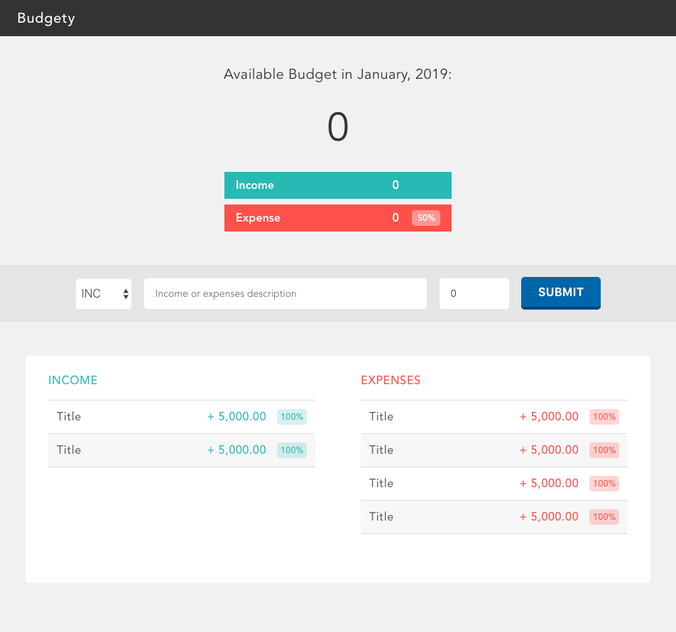

# シンプルな家計簿アプリBudgetyを作ってみよう！
[前の章はこちら](./page3.md)

前章まではトップ部分のその下のフォーム部分のコンポーネントを作成しました。  
この章では最後のリスト部分を作っていきます。

## 6. 収支リストの作成
最後にIncomeとExpensesをリスト表示するコンポーネントを作成します。  
今回は前回までと違って少し複雑になるので解説をしながら進めていきます。

### 6-1. 何はともあれまずは新しいコンポーネントを作る
`src/components/`配下に`bottom.vue`を作成してください。  
そして以下のようにコードを記述してください。

```vue
<!-- /src/components/bottom.vue-->
<template>
    <section class="bottom">
        <div class="list">
            <h2 class='list__title list__title--inc'>income</h2>
            <ul class="list__main"></ul>
        </div>
        <div class="list">
            <h2 class='list__title list__title--exp'>expenses</h2>
            <ul class="list__main"></ul>
        </div>
    </section>
</template>

<style scoped>
    .bottom {
        background: #fff;
        border-radius: 6px;
        display: flex;
        justify-content: center;
        margin: 48px auto;
        max-width: 880px;
        min-height: 320px;
    }
    .list {
        padding: 24px 32px;
        width: 50%;
    }
    .list__title {
        color: #333;
        border-bottom: solid 1px #ccc;
        font-size: 1.6rem;
        font-weight: 500;
        letter-spacing: .04em;
        text-transform: uppercase;
        padding: 0 0 12px;
    }

    .list__title--inc {
        color: #28B9B5;
    }
    
    .list__title--exp {
        color: #FF5049;
    }
</style>
```

これでリスト部分が大まかに出来ました。  
しかしこのコードをよく見ると、`<ul>`の子要素として`<li>`が記述されていません。なぜでしょうか？  
これには下記の様な理由があります。
- `<li>` の部分がIncome、Expenses共通する部分である  
- 動的に追加される要素である
- 頻出する

特に2つ目3つ目は重要な理由です。

### 6-2. 使い回せるリストのコンポーネントを作る
早速`list-item.vue`を作成しましょう。
下記の様にコードを記述してください。  
まだ動的な要素が無いのでシンプルな`<li>`のコンポーネントです。

```vue
<!-- /src/components/list-item.vue -->
<template>
    <li class="listItem">
        <p class="listItem__title">Title</p>
        <p class="listItem__value">+ 5,000.00</p>
        <p class="listItem__percentage">100%</p>
    </li>
</template>

<style scoped>
    .listItem {
        border-bottom: solid 1px #ddd;
        color: #666;
        font-size: 1.6rem;
        font-weight: 500;
        letter-spacing: .04em;
        display: flex;
        align-items: center;
        justify-content: space-between;
        padding: 12px;
    }

    .listItem:nth-of-type(even) {
        background: #f7f7f7;
    }
    
    .listItem__title {
        flex: 1 1 auto;
    }
    
    .listItem__percentage {
        border-radius: 4px;
        font-size: 1.2rem;
        margin: 0 0 0 1.25em;
        padding: 3px 4px 3px 5px;
    }

    .list__main.inc .listItem__value,
    .list__main.inc .listItem__percentage {
        color: #28B9B5;
    }

    .list__main.inc .listItem__percentage {
        background: rgba(120, 210, 200, .3);
    }

    .list__main.exp .listItem__value,
    .list__main.exp .listItem__percentage {
        color: #FF5049;
    }

    .list__main.exp .listItem__percentage {
        background: rgba(255, 120, 113, .3);
    }
</style>
```

とりあえず現状はこれでOKです。  
次に先ほど作った`bottom.vue`で`list-item.vue`を読み込みます。

```vue
<!-- /src/components/bottom.vue -->
<template>
    <section class="bottom">
        <div class="list">
            <h2 class="list__title list__title--inc">income</h2>
            <ul class="list__main">
                <list-item />
                <list-item />
            </ul>
        </div>
        <div class="list">
            <h2 class="list__title list__title--exp">expenses</h2>
            <ul class="list__main">
                <list-item />
                <list-item />
                <list-item />
                <list-item />
            </ul>
        </div>
    </section>
</template>

<script>
    import ListItem from './list-item.vue'

    export default {
        components: {
            ListItem
        }
    }
</script>

<!-- 省略 -->
```

ここまで出来たらブラウザ上で確認してみましょう。  
下の画像の様になっていればOKです。
<p align="center"></p>

良い感じに出来ましたね！これでBudgetyも無事完成...とは勿論いきません。  
現状は静的なサイトと何ら変わらない物をVueを使い各コンポーネントに分割、配置して表示したに過ぎません。  

Vueを勉強する旅はまだまだ始まったばかりです。  
次回からはいよいよJavascriptを用いた開発がスタートします。  


[前に戻る](./page3.md)　 [次に進む](./page5.md) 
