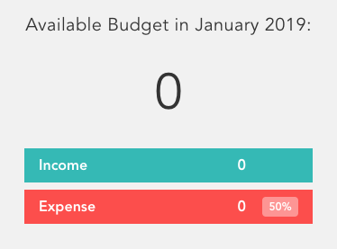

# シンプルな家計簿アプリBudgetyを作ってみよう！
[前の章はこちら](./page4.md)

前章までで各コンポーネントのHTML・ｗCSS部分を作り、表示する所までは終わりました。  
しかし、このままではただのモックアップに過ぎません。  
これからは今まで作った各コンポーネントにステート（状態）やロジックなどを持たせ、  
アプリケーションとして機能するようにしていきます。  
まずは最上部のバランスとIncome、Expensesの値をVueでコントロール出来るようにしていきます。

この章から新しい用語やVueの機能が出てきて少しややこしいかもしれませんが、頑張りましょう！

## 7. StateとProps
さて、Budgetyで扱う情報にはどういった物があるでしょうか？  
バランスや収支の合計、リストに表示するディスクリプションや各項目の数値などがありますね。  
この様な情報をState（ステート・状態）と言います。
Vueでは`data`と言う物を用いてこれを表現し、各コンポーネントがそれぞれ持つ事が可能です。しかしそれらのStateは基本的に外部のコンポーネントから参照する事は出来ません。  
それが例えそのコンポーネントの親であってもです。  
その為それぞれのコンポーネントにStateを持たせてしまうと、他のコンポーネントから参照するのが難しくなります。  
そこで今回は全ての情報を`main-content.vue`の中で管理し、各コンポーネントに受け渡す事にします。

> #### チョイ足しポイント
> 今回は`main-content.vue`にStateを集約していますが、  
> これを`vuex`を用いて状態管理を行うように変更してください。

### 7-1. dataオプション
まずは`top.vue`が必要とするStateを作成します。  
`main-content.vue`を開いて追加していきましょう。  
`<script>`の中に`data`オプションの関数を作りStateを管理出来るようにします。

```vue
<!-- /src/components/main-content.vue -->

<!-- 省略 -->
<script>
import TheHeader from './the-header.vue'
import Top from './top.vue'
import Middle from './middle.vue'
import Bottom from './bottom.vue'

export default {
    components: {
        TheHeader,
        Top,
        Middle,
        Bottom
    },
    // State - 追加部分
    data() {
        return {
            totalAmount: 0,
            incomeTotal: 0,
            expensesTotal: 0
        }
    }
}
</script>
```

これで`top.vue`が必要なStateを作る事が出来ました。  
次にこれらを`top.vue`側で受け取れるようにします。

> #### `data`は関数でなくてはならない
> これは各インスタンスが返されるデータオブジェクトの独立したコピーを保持できるためです。
> 実は`data`は関数にせず、`components`と同じ様にオブジェクトで定義する事も可能です。  
> しかし関数を用いない場合、`data`の内容はすべての他のインスタンスのデータに影響します。

### 7-2.　親から子へのデータの受け渡し

`top.vue`を開き、以下の様に編集してください。

```vue
<!-- /src/components/top.vue -->
<template>
    <section class="top">
        <h1 class="budget__title">Available Budget in January 2019:</h1>
        <p class="budget__total"> {{ totalAmount }} </p>
        <div class="budget__income">
            <p class="budget__text">income</p>
            <p class="budget__value"> {{ incomeTotal }} </p>
            <p class="budget__percentage"></p>
        </div>
        <div class="budget__expenses">
            <p class="budget__text">expense</p>
            <p class="budget__value"> {{ expensesTotal }}</p>
            <p class="budget__percentage">50%</p>
        </div>
    </section>
</template>

<script>
    export default {
        props: {
            totalAmount: Number,
            incomeTotal: Number,
            expensesTotal: Number
        }
    }
</script>
```

次に`main-content.vue`を開き、`<template>`を編集します。
```vue
<!-- /src/components/main-content.vue -->
<template>
    <div class="mainContent">
        <the-header />
        <top
            v-bind:total-amount="totalAmount"
            v-bind:income-total="incomeTotal"
            v-bind:expenses-total="expensesTotal"
        />
        <middle />
        <bottom />
    </div>
</template>

<!-- 省略 -->
```

早速ブラウザで確認してみましょう。画像のように無事０が表示されていればOKです。  
<p align="center"></p>

さて今回記述したコードの中に幾つか新しい要素が出てきましたね。順を追って解説していきます。

#### 7-2-1. Mustache Syntax - マスタッシュ記法
所々に散見するこの`{{ }}`。これをマスタッシュ記法、マスタッシュバインディングと言います。  
`{{`が口ひげの様に見えるのが語源みたいです。※詳細は要確認   
この記法を用いてデータを表示した場合、基本的にはテキストデータとしてレンダリングされます。  
この記法は色々なデータや、後ほど出てくるMethodを用いて加工した物、今回の様に親コンポーネントから受け取ったデータを表示したりなど、最頻出と言っても過言ではないので覚えておきましょう。

#### 7-2-2. propsオプション
親コンポーネントからテンプレートで子コンポーネントを使用するとき、属性（プロパティ）としてコンポーネントにデータを持たせ受け渡す事が出来ます。  
このデータの受け渡しに用いるものがPropsです。  
また、親から子へpropsを通じてデータを受け渡す事を ***Props Down*** と言います。

下記の例では`massage`という属性で単純な文字列を持たせています。  
この属性はプログラミング言語の関数の引数と同じ様なもので自由に持たせる事が出来ます。
```vue
<!-- Parent Component -->
<child-component message="こんにちは">
<child-component message="おやすみなさい">
```

子コンポーネントでは`props`オプションを利用し、受け取りたい属性名を指定します。  
親が定義した属性を子が`props`として受け取る事で、自分のデータのように使用できるようになります。

```vue
<!-- Child Component -->
<template>
    <p> {{ message }}</p>
</template>

<script>
export default {
    props: ['message']
}
</script>
```

```html
<!-- 実際の描画 -->
<p>こんにちは</p>
<p>おやすみなさい</p>
```

これで一つのコンポーネントだけを使い、別々のメッセージを表示する事が出来ました！
しかしまだ気になる事があります。  

このサンプルコードはpropsに配列が使われていますが、Budgetyのコードではオブジェクトになっています。  
更にはNumberと言う文字列も...これはなぜでしょうか？

> #### Propsのプロパティ名がキャメルケース(e.g projectName)の場合
> 受け取るプロパティ名がキャメルケースを用い単語を連ねている場合、`<template>`内で属性として使う際にダッシュケース（ケバブケース・ハイフンつなぎ）（e.g project-name）を用いるようにしてください。
> ```vue
> <!-- プロパティ名がhelloWorldの場合 -->
> <template>
>   <some-component v-bind:hello-world="goodbyes">
> </template>
> ```


#### 7-2-3. プロパティの型
サンプルのコードでは配列を用いプロパティ名の文字列として列挙していました。  
しかしながら、この状態では各プロパティにどんなデータが渡ってくるか分かりません。  
渡ってくるプロパティが数値であって欲しいのに文字列が渡ってきてしまうと、プログラムが上手く動作しないかもしれません。  
propsオプションはプロパティのキーと値に、それぞれのプロパティ名と型を設定したオブジェクトの配列としてプロパティを列挙することが可能で、これを用いる事により意図せぬ型のプロパティが渡ってきても事前にエラーが発生する様になり、バグを事前に防ぐ事が可能になります。実質このパターンがベストプラクティスと言えるので、この形を用いるようにしてください。

先程のサンプルコードの`child-component`を書き換えるとこの様なコードになります。

```vue
<!-- Child Component -->
<template>
    <p> {{ message }}</p>
</template>

<script>
export default {
    props: {
        message: String
    }
}
</script>
```

### 7-3. リアクティブデータとデータバインディング
Vueのコードを見ていると、特にメソッドを呼び出しているわけでもないのに何か処理をしている事に気付いたかもしれません。リアクティブデータとは、Vueによって**取得した時**と**代入した時**のフック処理が登録された、Vueが ***反応できるデータ*** のことを言います。単純に`data`に代入をした時にも、実は内部ではいろいろな処理が行われており、これがVueの心臓部とも言えるリアクティブシステムです。

また、今回のコードの様にデータと描画を同期させる仕組みの事を ***データバインディング*** と言います。  
HTMLで作られたUIを操作するのに必要不可欠なのがViewの管理、つまりDOMの更新や状態の管理です。  
データバインディングは簡単に言えば、Javascriptのデータとそれを使用する場所を紐づけ、データに変化があれば自動的にDOMを更新する事です。

### 7-4. ディレクティブとv-bind

今回実際に記述したコードでは属性名の前に`v-bind`を付けてデータを受け渡しています。  
この様なVueがDOMの要素について何かする事を伝えている、プレフィックスの付いたHTMLの属性を**ディレクティブ**と言います。  
Vueのディレクティブは基本的に全て`v-`のプレフィックスが付いています。
そしてディレクティブの値は、***Javascriptの単一な式*** と言う事が重要なポイントになります。

```vue
<!-- Example -->
<div message="text"></div>
<div v-vind:message="text"></div>
```

この場合`v-bind`の無い`text`はただの文字列となりますが、`v-bind`が付いている方の`text`は**textと言うJavascriptの変数**を表します。厳密に言えばアプリケーションに登録されているデータ用オブジェクトに登録された`text`というプロパティになります。

**`v-bind`** は一つ以上の属性またはコンポーネントのプロパティと式を動的に束縛します。
簡単に言えば、属性の値としてJavascriptの変数を用いる事が出来るようにします。
マスタッシュはテキストデータのみしか表現出来ないので、こう言った属性で変数を用いたい場合などに`v-bind`を使用します。
また`v-bind:`のショートハンドとして`:`が使えます。慣れたらこちらを使うと良いでしょう。  
このドキュメントも今後はショートハンドを使用していきます。

```vue
<!-- v-bindも:も同じ意味 
    　totalAmountなどはjsの変数 -->
<top
    v-bind:total-amount="totalAmount"
    :income-total="incomeTotal"
    :expenses-total="expensesTotal"
/>
```

### 7-5. タイトルっぽい部分の日付を動的にする
`top.vue`のタイトルっぽい部分ですが、西暦と月が記述されていますよね？  
この部分も本来であれば日付を動的に取得して表示したいですね。  
ではさっそく`main-content.vue`のデータに追加を...と思ったそこのあなた！ちょっと待った！  
この部分は特に他のコンポーネントに必要な情報ではないですよね？`top.vue`の中だけで完結する、と言えます。  

こう言った場合は今回の様にデータを集約しているコンポーネントやVuex、簡単なStoreパターンのStoreなどを使用していたとしても、そのコンポーネントに状態を持たせ、そこで完結するようにしましょう。  
Reactではコンポーネントは極力ステートレスにするべき、と言った思想でコンポーネントが作られていきますが、  
Vueではそこでしか使わないのであればガンガン、ステートフルなコンポーネントを使うべしと言った思想になります。

#### 7-5-1 .ライブラリのインストール
自力で日付を取得し整形して表示しても勿論良いのですが、今回はOSSの恩恵に預かりプラグインを利用して簡単に実装していこうと思います。
まずはターミナルに戻りサーバーを `ctrl + c` で終了してください。
終了して通常の画面に戻ったら下記のコマンドでライブラリをインストールしてください。

```bash
$ yarn add date-fns@2.0.0-alpha.27
```

インストールが終わったら再びサーバーを起動しましょう。  
覚えていますか？笑 

> date-fnsって？  
> date-fnsは日付の処理を簡単にしてくれるライブラリです。似たようなライブラリに有名なMomentがありますが、Momentはファイルのサイズが大きく不要なコードも含まれてしまう事から、もっと軽量な日付処理のライブラリを、と作られた物です。

#### 7-5-2. 実装する
ライブラリのインストールも終わったので実装に移ります。  
`top.vue`を以下の様に変更してください。

※ date-fnsの使い方は [公式ドキュメント](https://date-fns.org/v2.0.0-alpha.27/docs/format) を参照してください。

```vue
<!-- /src/components/top.vue -->
<template>
    <section class="top">
        <h1 class="budget__title">Available Budget in {{ getCurrentDate() }}:</h1>
        <!-- 省略 -->
    </section>
</template>

<script>
    import { format } from 'date-fns'
    export default {
        props: {
            totalAmount: Number,
            incomeTotal: Number,
            expensesTotal: Number
        },
        methods: {
            getCurrentDate() {
                return format(new Date, 'MMMM, yyyy')
            }
        }
    }
</script>

<!-- 省略 -->
```

#### 7-5-3. methodsオプション
また新しいオプションが出てきました。  
しかし、`methods`は難しい事はありません。このオブジェクトにはアプリケーションで使用するメソッド、つまりは何かしらの処理を行う関数を登録する場所です。  
コードを管理しやすくする為に処理を分けたり、イベントハンドラなど細かな実装を担当します。

先程実装した`getCurrentDate()`はシンプルに`date-fns`を利用し`Month, year`の形式にフォーマットした日付を返しているだけです。マスタッシュ以外にも`v-bind`を用いたディレクティブにも利用可能です。

---

さて、とりあえずこれで最上部にデータを渡すのは大丈夫そうですね。  
この後フォームから入力されたデータを`main-content.vue`で受け取り、良い感じに計算すれば良さそうです。  
次の章からはここを進めていきます。


[前に戻る](./page4.md)　 [次に進む](./page6.md) 
