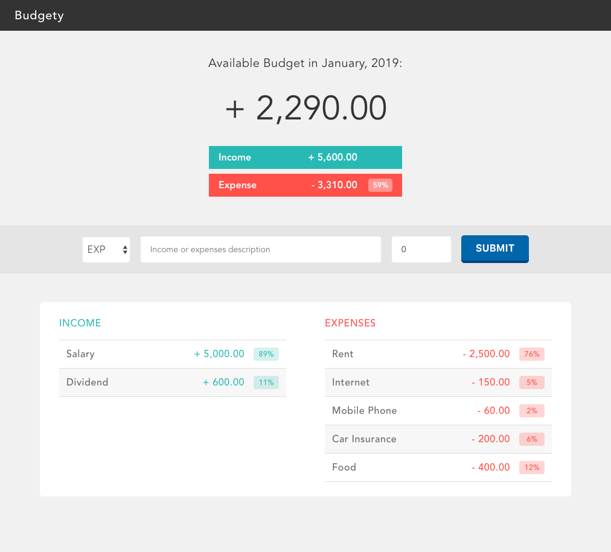
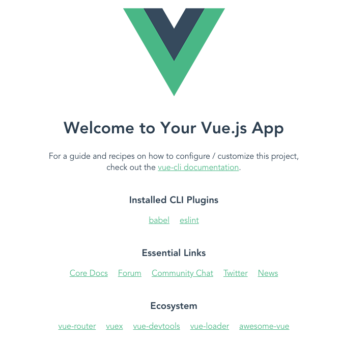

# Vue.js ワークショップ
Vue.js初心者向けのワークショップです。  
初めて触る人も、ちょっとだけ触ったことがある人も一緒にマッタリとやっていきましょう。  
多少の経験があり、物足りない人には追加の要素もあります。  
（ワークショップでの解説はしません。）

## 0. 今日はやらないこと
本日は初心者向けと言う事もあり、Vue RouterやVuexの解説は行いません。  
また講師は普段、Typescriptを用いて開発を行っていますが、今回もその辺りは触れません。

# シンプルな家計簿アプリBudgetyを作ってみよう！
ただToDoを作るだけでは定番過ぎて面白くないので、収支を登録・確認出来る、シンプルな家計簿アプリを作ってみましょう！

#### 完成イメージ
<p align="center"></p>

## 1. 始める前に - 環境の構築
実際にVueを使い始める前にプロジェクトを作成し開発環境を用意しましょう。  
PCには既にNode.jsが勿論インストールされていますよね？  
念の為チェックしておきましょう。
```
$ node -v
v10.15.0
```
この様に表示されればNodeは既にインストールされています。  
　  
### 1-1. Vue Cliのインストール
次にVueのプロジェクトを色々とよしなにしてくれるVue Cliを用いてプロジェクトを作っていきます。  
まずはVue Cli v3をインストールしましょう。

#### npm
```bash
$ npm install -g @vue/cli
```
#### yarn
```bash
$ yarn global add @vue/cli
```
　  
### 1-2. Vue Cliを使ってプロジェクトを作成する。
インストールが終わったらvue cliを用いてプロジェクトを作成します。  
実行すると色々と聞かれますが今日はdefaultを使って進めます。
```bash
$ vue create project-nam
? Please pick a preset: (Use arrow keys)
> default (babel, eslint)
  Manually select features
```
> ##### チョイ足しポイント  
> Manually select featuresでカスタムしてプロジェクトを作ってみましょう。  
> その際にcss pre-processor(sassなど）や、vuexをインストールしてみましょう。  
> 既に知識があり物足りない人はこの「チョイ足しポイント」に挑戦してみてください。

　  
インストールが終わったら、同じくターミナルで次のコマンドを実行してみましょう。
```bash
$ cd projext-name
$ yarn serve
// 色々と表示される
```
最後に `DONE  Compiled successfully in 3995ms` の様な表示があれば無事に成功しています。  
その後画面の表示の通りブラウザで [`http://localhost:8080`](http://localhost:8080/) にアクセスしてみましょう  
以下の様な画面が表示されていればOKです。  

<p align="center"></p>

これで開発に必要な環境を整える事は完了です。  
ここまでくればすぐにでも開発を進める事が出来ます。  
　  
それでは実際にVueを使ってアプリケーションを作っていきましょう。  
Let's get started!!  
　  
[次に進む](./docs/page2.md)
